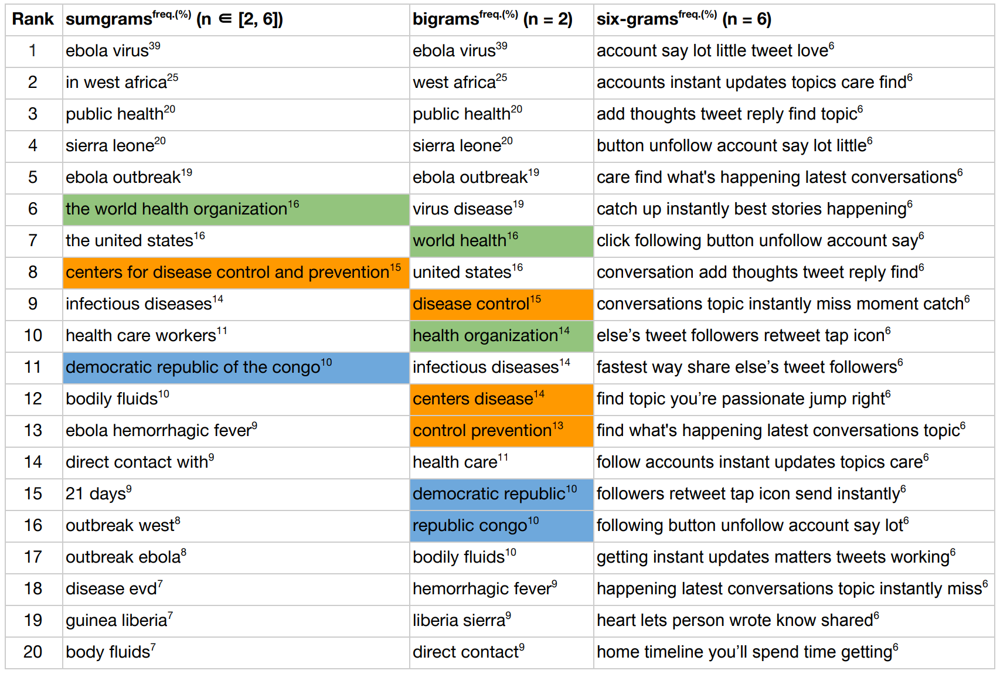
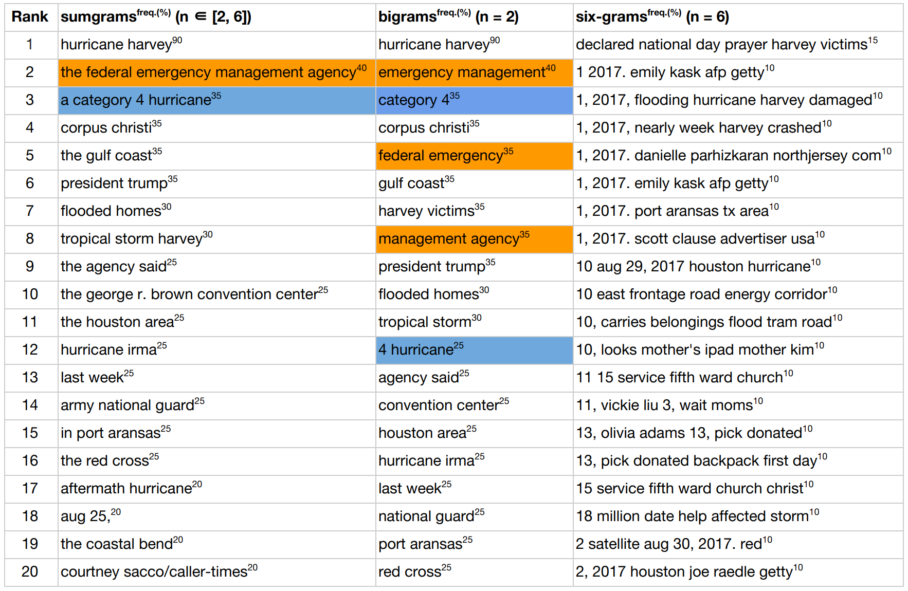

# sumgram

sumgram is a tool that summarizes a collection of text documents by generating the most frequent sumgrams (multiple ngrams) in the collection. Unlike convention ngram generators that split multi-word proper nouns, sumgram works hard to avoid this by applying two (`pos_glue_split_ngrams` and `mvg_window_glue_split_ngrams`) algorithms. The algorithms also enable sumgram to generate multiple ngrams, or "sumgrams" (bigrams, trigrams, k-grams, etc.) as part of the summary, instead of limiting the summary to a single ngram class (e.g., bigrams).

From Fig. 1, the 4-gram "centers for disease control and prevention" was split into 3 different  bigrams ("centers disease", "disease control", and "control prevention") by a conventional algorithm that generates bigrams. But sumgram detected and "glued" such split ngrams.

*Fig. 1: Comparison of top 20 bigrams and top 20 sumgrams (multiple ngrams) generated by sumgram for a collection of documents about the [2014 Ebola Virus Outreak](https://en.wikipedia.org/wiki/Western_African_Ebola_virus_epidemic). Proper nouns of more than two words (e.g., "centers for disease control and prevention") are split when generating bigrams, sumgram strives to remedy this.*


*Fig. 2: Comparison of top 20 bigrams and top 20 sumgrams (multiple ngrams) generated by sumgram for a collection of documents about [Hurricane Harvey](https://en.wikipedia.org/wiki/Hurricane_Harvey). Proper nouns of more than two words (e.g., "federal emergency management agency") are split when generating bigrams, sumgram strives to remedy this.*

## Additional Features
In addition to generating top sumgrams, sumgram ranks sentences and documents.
## Installation
Just type
```
$ pip install sumgram
```
## Recommended Requirement
For the best results, we recommend [installing and running Stanford CoreNLP Server](https://ws-dl.blogspot.com/2018/03/2018-03-04-installing-stanford-corenlp.html) for two reasons.
First, the "pos" in `pos_glue_split_ngrams` stands for Parts Of Speech. This algorithm needs a Part of Speech annotator in order to "glue" split ngrams, hence the need for Stanford CoreNLP server. However, if you do not install Stanford CoreNLP Server, sumgram is robust enough to attempt to glue split ngrams with the second algorithm `mvg_window_glue_split_ngrams`. 

Second, as part of ranking sentences, sumgram needs to segment the sentences in the documents. Stanford CoreNLP's [`ssplit`](https://stanfordnlp.github.io/CoreNLP/ssplit.html) annotator splits sentences after tokenization, and exploits the decisions of the tokenizer. Probabilitic methods (such as `ssplit`) for segmenting sentences are often outperform rule-based methods that use regular expressions to define sentece boundaries. If you do not install Stanford CoreNLP however, sumgram adopt a regular expression (`[.?!][ \n]|\n+`) to mark sentence boudaries. This rule can be passed (```--sentence-tokenizer``` - command line, ```sentence_tokenizer``` - python) as an argument to sumgram.

## Usage
### Basic usage:
```
$ sumgram path/to/collection/of/text/files/
```
### python script usage:
```
import json
from sumgram.sumgram import get_top_ngrams

doc_lst = [
    {'id': 0, 'text': 'The eye of Category 4 Hurricane Harvey is now over Aransas Bay. A station at Aransas Pass run by the Texas Coastal Observing Network recently reported a sustained wind of 102 mph with a gust to 132 mph. A station at Aransas Wildlife Refuge run by the Texas Coastal Observing Network recently reported a sustained wind of 75 mph with a gust to 99 mph. A station at Rockport reported a pressure of 945 mb on the western side of the eye.'},
    {'id': 1, 'text': 'Eye of Category 4 Hurricane Harvey is almost onshore. A station at Aransas Pass run by the Texas Coastal Observing Network recently reported a sustained wind of 102 mph with a gust to 120 mph.'},
    {'id': 2, 'text': 'Hurricane Harvey has become a Category 4 storm with maximum sustained winds of 130 mph. Sustained hurricane-force winds are spreading onto the middle Texas coast.'}
  ]
params = {
    'top_ngram_count': 10,
    'add_stopwords': 'image',
    'no_rank_sentences': True,
    'title': 'Top sumgrams for Hurricane Harvey text collection'
}

ngram = 2
sumgrams = get_top_ngrams(ngram, doc_lst, params=params)
with open('sumgrams.json', 'w') as outfile:
  json.dump(sumgrams, outfile)
```
### Examples:
### Generate top 10 (t = 10) sumgrams for the [Archive-It Ebola Virus Collection](https://archive-it.org/collections/4887):
```
$ sumgram -t 10 cols/ebola/
 rank  ngram                                                TF   TF-Rate
  1    in west africa                                       50    0.35 
  2    liberia and sierra leone                             46    0.33 
  3    ebola virus                                          44    0.31 
  4    ebola outbreak                                       41    0.29 
  5    public health                                        40    0.28 
  6    the centers for disease control and prevention       23    0.16 
  7    the united states                                    23    0.16 
  8    the world health organization                        22    0.16 
  9    ebola patients                                       20    0.14 
  10   health workers                                       20    0.14 
``` 
### Generate top 10 (t = 10) sumgrams for the [Archive-It Hurricane Harvey Collection](https://archive-it.org/collections/9323):
```
$ sumgram -t 10 cols/harvey/
rank  ngram                                                TF   TF-Rate
  1    hurricane harvey                                     20    0.47 
  2    tropical storm harvey                                10    0.23 
  3    2017 houston transtar inc.                           9     0.21 
  4    2017. photo                                          9     0.21 
  5    corpus christi                                       9     0.21 
  6    image 28 of                                          9     0.21 
  7    image 29 of                                          9     0.21 
  8    image 30 of                                          9     0.21 
  9    image 31 of                                          9     0.21 
  10   image 32 of                                          9     0.21
``` 
This collection has lots of images, but the "image" term might obscure more salient ngrams, so let's 
rerun the command, but this time consider "image" a stopword. As seen below such modification exposed more salient bigrams such as "buffalo bayou" and "coast guard"

```
$ sumgram -t 10 --add-stopwords="image" cols/harvey/
 rank  ngram                                                TF   TF-Rate
  1    hurricane harvey                                     20    0.47 
  2    tropical storm harvey                                10    0.23 
  3    2017 houston transtar inc.                           9     0.21 
  4    2017. photo                                          9     0.21 
  5    corpus christi                                       9     0.21 
  6    texas photo                                          9     0.21 
  7    27, 2017                                             8     0.19 
  8    buffalo bayou                                        8     0.19 
  9    coast guard                                          8     0.19 
  10   harvey photo                                         8     0.19 
``` 

### Generate top sumgrams from collection of URLs:
This requires dereferencing the URLs and [removing the HTML boilerplate](https://ws-dl.blogspot.com/2017/03/2017-03-20-survey-of-5-boilerplate.html). This example requires the [installation of NwalaTextUtils](https://github.com/oduwsdl/NwalaTextUtils).
```
from NwalaTextUtils.textutils import prlGetTxtFrmURIs
from sumgram.sumgram import get_top_ngrams

ngram = 2
uris_lst = [
  'http://www.euro.who.int/en/health-topics/emergencies/pages/news/news/2015/03/united-kingdom-is-declared-free-of-ebola-virus-disease',
  'https://time.com/3505982/ebola-new-cases-world-health-organization/',
  'https://www.scientificamerican.com/article/why-ebola-survivors-struggle-with-new-symptoms/'
]

doc_lst = prlGetTxtFrmURIs(uris_lst)
sumgrams = get_top_ngrams(ngram, doc_lst)

with open('sumgrams.json', 'w') as outfile:
    json.dump(sumgrams, outfile)
```

### Full usage
```
sumgram [options] path/to/collection/of/text/files/

Options:
-n                                  Base n (int) for generating top ngrams, if n = 2, bigrams are generated
-o, --output                        Output file
-s, --sentences-rank-count          The count of top ranked sentences to generate
-t, --top-ngram-count               The count of top ngrams to generate

--add-stopwords                     Comma-separated list of addition stopwords
--corenlp-host                      Stanford CoreNLP Server host (needed for decent sentence tokenizer)
--corenlp-port                      Stanford CoreNLP Server port (needed for decent sentence tokenizer)
--corenlp-max-sentence-words        Stanford CoreNLP maximum words per sentence
--debug-verbose                     Print statements needed for debugging purpose
--include-postings                  Include inverted index of term document mappings
--mvg-window-min-proper-noun-rate   Mininum rate threshold (larger, stricter) to consider a multi-word proper noun a candidate to replace an ngram
--ngram-printing-mw                 Mininum width for printing ngrams
--no-rank-docs                      Do not rank documents flag (default is True)
--no-rank-sentences                 Do not rank sentences flag (default is True)
--no-pos-glue-split-ngrams          Do not glue split top ngrams with POS method (default is True)
--no-mvg-window-glue-split-ngrams   Do not glue split top ngrams with MOVING WINDOW method (default is True)
--pos-glue-split-ngrams-coeff       Coeff. for permitting matched ngram replacement. Interpreted as 1/coeff
--pretty-print                      Pretty print JSON output
--rm-subset-top-ngrams-coeff        Coeff. for permitting matched ngram replacement. Interpreted as 1/coeff
--sentence-tokenizer                For sentence ranking: Regex string that specifies tokens for sentence tokenization
--shift                             Factor to shift top ngram calculation
--token-pattern                     Regex string that specifies tokens for document tokenization
--title                             Text label to be used as a heading when printing top ngrams
```